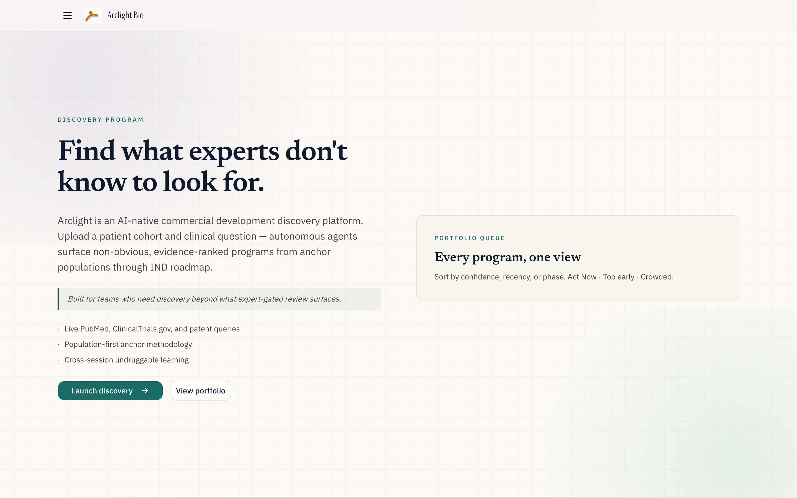
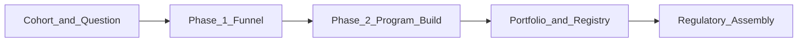
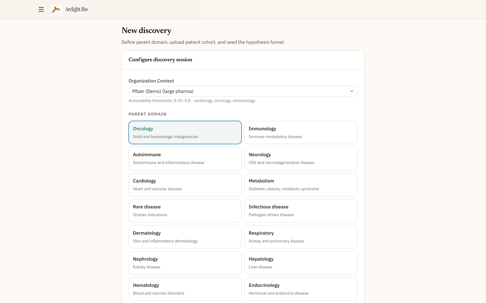
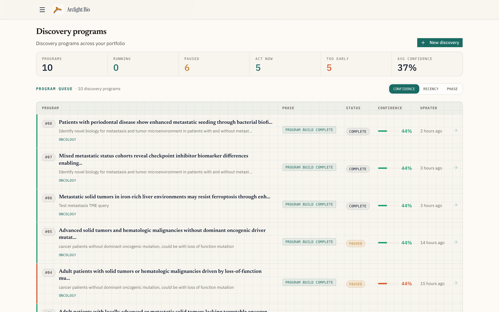
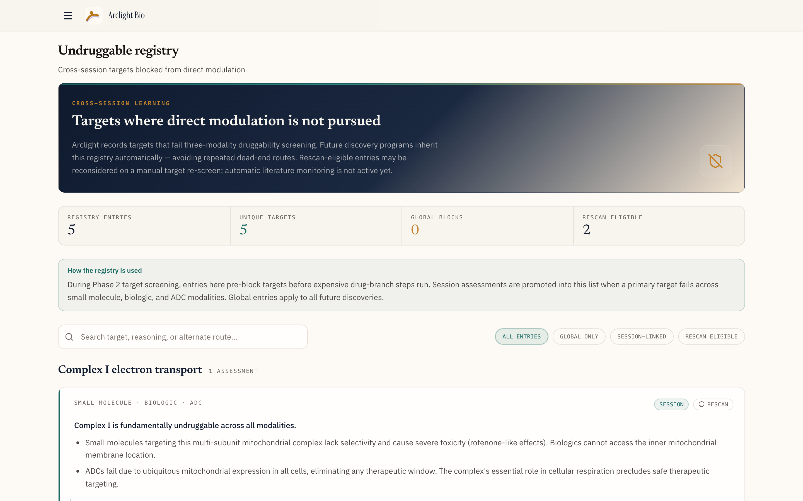
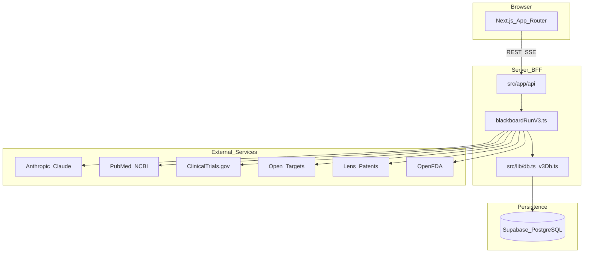
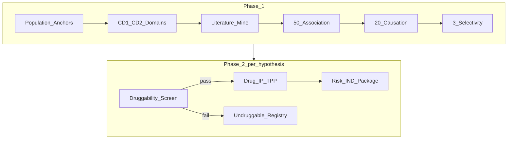

# Arclight Bio — Discovery Program

> **Find what experts don't know to look for.**

| | |
|---|---|
| **Event** | Nucleate NY BioHack 2026 · NextGen BioAgents |
| **Track** | 02 — Autonomous Research |
| **Sponsor challenge** | Pfizer — Commercial Development Discovery |
| **Secondary fit** | 05 — Regulatory & Documentation |
| **Product type** | AI-native commercial development discovery platform |
| **Live demo** | [https://arclightbio.vercel.app](https://arclightbio.vercel.app) |
| **Demo video** | _See [Submission TODOs](#submission-todos)_ |

**Discovery Program** is an autonomous research system for pharmaceutical commercial development. Upload a patient cohort and a clinical question — specialized agents run a two-phase pipeline from anchor populations through a structured hypothesis funnel to IND-ready program assessments, querying **live** PubMed, ClinicalTrials.gov, Open Targets, patents, and FDA data at every step.

Pfizer frames the challenge this way: _"Some of the most important treatment opportunities are the ones we don't see — the patient subgroup hidden inside a heterogeneous indication, the mechanism that connects two conditions thought to be unrelated. Expert review surfaces what experts already know to look for."_ Discovery Program is built to answer that gap.

---

## At a glance



| | |
|---|---|
| **Input** | Patient cohort CSV + clinical question + org context |
| **Process** | 30+ autonomous agents · 50→20→3 hypothesis funnel · live API evidence |
| **Output** | Ranked discovery programs with trust scores, TPP blueprints, IND roadmaps, regulatory provenance |
| **Differentiator** | Cohort-first, cross-domain mining — not taxonomy-bound expert search |



---

## Quick start

```bash
cd arclightbio
cp .env.local.example .env.local   # add ANTHROPIC_API_KEY at minimum
npm install
npm run dev
```

Open [http://localhost:3000](http://localhost:3000). Requires **Node.js 18.17+**.

### Five-minute walkthrough

| Step | Action |
|------|--------|
| 1 | Browse `/` — product story and pipeline overview |
| 2 | Open `/discover` — upload `test-data/oncology-lof-no-driver-cohort.csv` |
| 3 | Set parent domain **Oncology**, innovation **medium**, org **Pfizer (Demo)** |
| 4 | Enter a clinical question (sample below) and launch |
| 5 | Watch `/opportunity/[id]` — live agent trail, evidence cards, phase panels |
| 6 | Review `/dashboard` — portfolio queue with trust scores and actionability zones |

**Sample query:** _What non-driver loss-of-function biology in refractory solid and heme tumors suggests intervention-ready programs beyond standard oncogenic driver targeting?_

**Sample cohort:** 20 refractory oncology patients with LOF tumor suppressor profiles and no dominant oncogenic driver — designed to surface non-obvious cross-domain biology (`test-data/oncology-lof-no-driver-cohort.csv`).

Run tests: `npm test` (16 unit test files). Optional headless pipeline: `node scripts/run-v3-discovery-e2e.mjs`.

---

## The problem

Commercial development teams evaluate a **handful of opportunities over months**. Each assessment is static, expensive, and anchored on targets and indications experts already know to search. Three structural failures make the highest-value opportunities invisible:

| Failure | What happens | Cost |
|---------|--------------|------|
| **Taxonomy-bound search** | Review scopes to familiar indication labels and known target classes | Patient subgroups inside heterogeneous indications stay hidden |
| **Indication silos** | Cardiac signals never trigger oncology conversations; cross-condition mechanisms are never connected | Mechanisms linking unrelated conditions are missed entirely |
| **Point-in-time reports** | Assessments go stale the day they are written; no system watches the literature | Conclusions age while the science moves |

Discovery Program inverts the workflow: start from **your cohort and clinical question**, not your existing search taxonomy. Autonomous agents mine cross-domain patterns, rank evidence from live public databases, and narrow hypotheses through a structured funnel — producing auditable, intervention-ready programs in a single session.

### Who this serves

- BD & licensing teams evaluating portfolio expansion
- Discovery leads searching beyond known target classes
- CSO office and innovation teams prioritizing capital allocation
- Commercial development groups running Pfizer-style opportunity identification

### Business outcomes

- **Faster identification** — full 50→20→3 funnel plus Phase 2 program build in one autonomous run, versus months of committee review
- **Lower dead-end spend** — undruggable registry blocks failed targets across all future sessions
- **Portfolio-ready output** — market-sized anchors, Act Now actionability zones, TPP blueprints, IND regulatory packages
- **Auditability** — every agent step logged with source URLs; human reviewers can trace any claim to its origin

---

## What Discovery Program is

Discovery Program is not a chatbot wrapper or a literature search tool. It is a **living discovery engine** built around a persisted **discovery program** artifact (internally: Opportunity Object) that 30+ specialized agents read and write throughout a two-phase blackboard pipeline.

| Layer | What it does |
|-------|--------------|
| **Cohort intelligence** | Parses patient CSV, mines CD1 co-occurring domain patterns from your population |
| **Anchor methodology** | Defines biology and resistance anchor populations with market sizing before hypotheses multiply |
| **Expert domain merger** | Combines CD1 cohort patterns with CD2 literature/Open Targets associations |
| **Hypothesis funnel** | 50 association → 20 causation → 3 selectivity hypotheses with falsification design |
| **Program build** | Per-hypothesis druggability screen, drug path, IP/FTO, modality, TPP, risk scoring, IND package |
| **Cross-session memory** | Undruggable registry prevents repeated investment in blocked targets |
| **Portfolio layer** | Dashboard queue with program trust scores and org-weighted actionability zones |

Every discovery session queries **real public APIs at runtime**. There is no cached demo JSON, no pre-filled evidence, no frozen snapshot pretending to be research.

---

## Product walkthrough

### Home — the commercial discovery story

Route: `/`

The marketing home walks through the full product narrative: the gap in taxonomy-bound BD, live evidence sources, anchor methodology, expert domain merger, hypothesis funnel, Phase 2 program build, undruggable registry, and portfolio trust. Primary CTA launches discovery; secondary CTA opens the portfolio dashboard.


---

### Discover — launch a discovery program

Route: `/discover`

The discover flow collects everything agents need before the pipeline starts:

| Field | Options / notes |
|-------|-----------------|
| **Organization context** | Pfizer (Demo) default — sets commercial weights and actionability thresholds |
| **Parent domain** | 15 therapeutic areas (oncology, immunology, cardiology, rare disease, …) |
| **Innovation appetite** | `lowest` · `medium` · `highest` — controls hypothesis novelty and agent temperature |
| **Clinical question** | Free-text discovery thesis seeding the program |
| **Patient cohort CSV** | Required columns: `patient_id`, `primary_diagnosis`, `comorbidities`, `biomarkers`, `resistance_status`, `notes` |

On launch, agents schedule asynchronously. The UI redirects to the live discovery program page where the agent trail begins streaming.



**Revise mode** (`/discover?revise=[id]`) updates query or domain while retaining the cohort. From the program page, users can also add cohort data or revise the query mid-pipeline — the blackboard resumes from the appropriate checkpoint.

---

### Discovery program page — live autonomous pipeline

Route: `/opportunity/[id]`

The program page is the core product surface. While agents run, the page streams live updates via Server-Sent Events: agent status, audit trail entries, evidence cards, and score changes.

#### Header

- Discovery thesis sentence (auto-generated program summary)
- Clinical query and population definition
- Program trust badge — composite discovery confidence with funnel / evidence / biology breakdown
- Session meta: status, current pipeline phase, parent domain, innovation level, cohort link
- Controls: pause/resume agents, revise query, add cohort data

#### Phase 1 panels

| Panel | Content |
|-------|---------|
| **Anchor profiles** | Biology and resistance anchor populations — falsifiable claims, biomarkers, market size (USD B), rationale |
| **Expert domains** | CD1 cohort co-occurrence patterns + CD2 literature/target associations; merged cross-context domains |
| **Hypothesis funnel** | Expandable 50 / 20 / 3 stages with hypothesis statements at each gate |
| **Selectivity hypotheses** | Top 3 ranked survivors — selectable to drive Phase 2 view |
| **Mechanistic chain** | Causal chain for selected hypothesis |
| **Target family** | Family and pathway context |
| **Ranked targets** | Scored targets with rationale and falsification experiment design |

#### Phase 2 panels (per selectivity hypothesis)

| Panel | Content |
|-------|---------|
| **Druggability screen** | Three-modality gate: small molecule, biologic, ADC — undruggable primaries blocked before expensive steps |
| **Drug branch** | Existing asset vs. NME path; modality, druggability %, IP ownership, FTO, redesign feasibility |
| **TPP blueprint** | Target Product Profile for the selected program |
| **Risk of failure** | Aggregated risk score with component breakdown |
| **IND package** | Preclinical roadmap, CMC plan, toxicology plan, clinical trial design — FDA/EMA agency mapping |

#### Audit trail sidebar

Live agent activity indicator plus expandable timeline: every step with timestamp, agent name, summary, reasoning, and **clickable source links** back to PubMed, trials, patents, and other live APIs.

---

### Portfolio dashboard

Route: `/dashboard`

The dashboard is the BD portfolio view — all discovery programs in one queue.



**Portfolio metrics:** total programs · running · paused · Act Now · Too early · average confidence

**Each program row shows:**
- Discovery thesis title and clinical query
- Parent domain and current pipeline phase
- Actionability zone stripe (Act Now / Too early / Crowded)
- Program trust score bar with tier label (Exploratory / Moderate / Strong)
- Status, evidence counts, last updated

Sort by confidence, recency, or pipeline phase. Polls live for running sessions.

---

### Undruggable registry

Route: `/undruggable`

Cross-session institutional memory. When Phase 2 target screening finds a primary target undruggable across all three modalities, the target is recorded with reasoning and an alternate intervention path. Global entries block that target in **all future** discovery sessions.



Filter by scope (global / session-linked / rescan-eligible), search by target name, jump back to originating programs.

---

### Regulatory assembly

Route: `/opportunity/[id]/regulatory`

For programs in the **Act Now** actionability zone, regulatory assembly version-locks the discovery program and generates a provenance-mapped package aligned to **FDA January 2025 AI guidance**:

- AI role declaration and credibility report
- Evidence sections by agent and data source with regulatory weight ratings
- Compliance gap report
- Provenance tree from all evidence cards
- **PDF export** via jsPDF — downloadable regulatory package

---

## How well it serves commercial development discovery

Discovery Program is architected for the Pfizer Commercial Development Discovery challenge: reveal opportunities that expert-gated, taxonomy-bound processes structurally cannot find — faster, with cited evidence, at portfolio decision quality.

| Commercial need | How the product delivers |
|-----------------|-------------------------|
| Surface hidden patient subgroups | Cohort-first anchors mine biology and resistance populations from **your** patients, not indication labels |
| Find cross-condition mechanisms | CD1 + CD2 expert domain merger connects cohort patterns to literature and target associations across domains |
| Compress identification time | One session runs 50→20→3 funnel + Phase 2 program build — architecture built for speed, not slide decks |
| Reduce dead-end target spend | Undruggable registry with global blocks — institutional memory across sessions |
| Portfolio-weighted decisions | Org-context scoring (Pfizer demo default) — same evidence ranks differently by commercial fit and risk tolerance |
| Audit-ready evidence | Agent trail with source URLs on every step — human reviewers trace any claim to its origin |
| IND-ready output | TPP blueprint, risk scoring, preclinical/CMC/tox/clinical trial design in IND package panel |

The system is strongest with a real cohort CSV and a sharp clinical question — exactly the inputs commercial development teams already have but cannot process at this depth manually.

---

## Architecture



Discovery Program uses a **Backend-for-Frontend** pattern: all agent orchestration, external API calls, and database writes run server-side. The browser consumes REST and SSE endpoints. No database credentials or API keys reach the client.

| Layer | Technology |
|-------|------------|
| Framework | Next.js 14 App Router |
| Language | TypeScript |
| UI | Tailwind CSS · shadcn/ui · Lucide · framer-motion |
| State | Zustand · TanStack Query |
| Database | Supabase PostgreSQL (optional in-memory fallback for local dev) |
| LLM | Anthropic Claude (`claude-sonnet-4-20250514`) |
| PDF | jsPDF |
| Deployment | Vercel with `waitUntil` for long-running pipelines |

### Blackboard orchestration

The pipeline is orchestrated by `src/lib/blackboardRunV3.ts`:

- **Sequential Phase 1** — one opportunity, checkpointed steps
- **Parallel Phase 2** — runs for each of the top 3 selectivity hypotheses
- **Scheduling** — discover POST returns immediately; pipeline runs async via Vercel `waitUntil` (or fire-and-forget locally)
- **Locks** — per-program filesystem + in-process lock prevents concurrent runs
- **Checkpoints** — `blackboard_state.completedSteps` enables pause/resume without re-running completed agents
- **Abort** — user pause triggers `AbortController`; pipeline saves checkpoint and resumes on next launch

**Status lifecycle:** `initialising` → `agents_running` → `complete` · (pause/resume at any checkpoint)

---

## Agent pipeline

### Phase 1 — Hypothesis funnel

| Step | Agent | Output |
|------|-------|--------|
| Population definition | `patientPopulationAgent` | Inclusion/exclusion, unmet need |
| Anchor profiling | `anchorPopulationAgent` | Biology + resistance anchor populations |
| Market sizing | `marketSizeAgent` | USD B market estimate per anchor |
| CD1 pattern mining | `cd1PatternAgent` | Cohort co-occurring domains outside parent TA |
| CD2 association scan | `cd2AssociationAgent` | PubMed + Open Targets cross-domain associations |
| Expert domain merger | `expertDomainMergerAgent` | Merged CD1/CD2 expert domains |
| Biology recurrence | `biologyRecurrenceScorerAgent` | Recurrence scoring across domains |
| Association filter | `crossDomainAssociationFilterAgent` | Cross-domain association gate |
| Literature review | `crossDomainLiteratureAgent` | Live PubMed + trials + patents |
| Context mining | `crossContextHypothesisMinerAgent` | Cross-context mechanism bridges |
| Association generate | `associationHypothesisGeneratorAgent` | ~50 association hypotheses |
| Causation filter | `causationFilterAgent` | ~20 causation survivors |
| Selectivity filter | `selectivityFilterAgent` | Mechanistic selectivity gate |
| Selectivity rank | `selectivityRankerAgent` | Top 3 force-ranked |
| Target ranking | `selectivityTargetRankerAgent` | Ranked targets per hypothesis |
| Target family (×3) | `targetFamilyContextAgent` | Family/pathway context |
| Falsification design (×3) | `falsificationExperimentDesignerAgent` | Testable falsification paths |

Phase 1 completion computes **program trust score**, sets actionability zone, and selects default Phase 2 hypothesis.

### Phase 2 — Program build (per selectivity hypothesis)

| Step | Agents | Output |
|------|--------|--------|
| Target druggability screen | `targetDruggabilityScreenAgent` | Three-modality gate; undruggable → registry |
| Existing drug check | `existingDrugCheckerAgent` | Known asset landscape |
| IP & FTO | `ipOwnershipAgent`, `ftoAnalysisAgent` | Ownership and freedom-to-operate |
| Druggability assessment | `druggabilityAssessmentAgent` | NME druggability scoring |
| Modality selection | `modalitySelectorAgent` | Recommended modality |
| TPP blueprint | `tppGeneratorAgent` | Target Product Profile |
| Risk scoring | 7 risk scorers + aggregator + pathway mapper | Component risk breakdown |
| IND planning | preclinical, CMC, tox, clinical trial design agents | IND regulatory package |
| IND assembly | `indPackageAssemblerAgent`, registry agents | Complete IND package JSON |

First druggable hypothesis is auto-promoted if the current selection is blocked.



---

## Live data and evidence

Every agent step queries authoritative public biomedical sources at runtime.

| Source | Module | Pipeline role |
|--------|--------|---------------|
| PubMed (NCBI) | `src/api/pubmed.ts` | Literature synthesis, CD2 associations |
| ClinicalTrials.gov | `src/api/clinicalTrials.ts` | Trial landscape, competitive context |
| Open Targets | `src/api/openTargets.ts` | Target–disease associations, druggability |
| Lens Patents | `src/api/lens.ts` | IP and prior-art landscape |
| OpenFDA | `src/api/openFda.ts` | Drug labels, adverse events (Phase 2) |
| Anthropic Claude | `src/api/anthropic.ts` | Agent reasoning across all stages |

### Evidence cards

Each agent contributes **evidence cards** — structured claims with:
- Content (sanitized scientific prose)
- Source URL and source type (linking back to live API results)
- Contributing agent identity
- Quality scores: sample size, study design, source credibility, replication, recency, composite
- Optional hypothesis linkage and challenge metadata

### Agent audit trail

Every pipeline step is recorded in `agent_trail_entries`:
- Step key, agent name, kind (started / completed / failed / source / reasoning)
- Summary and reasoning text
- Source URLs captured during external API calls
- Linked evidence card IDs

The audit trail streams live to the program page sidebar during discovery and persists for post-hoc review. This is the human-auditable layer that makes autonomous discovery trustworthy for commercial decision-making.

---

## Scoring, trust, and actionability

### Program trust score

The primary confidence metric for discovery programs. Computed at Phase 1 completion and refreshed at Phase 2 completion:

```
overall = 0.35 × funnel_coverage + 0.45 × evidence_strength + 0.20 × biology_signal
```

| Component | Meaning |
|-----------|---------|
| **Funnel coverage (35%)** | Progress toward 50 association / 20 causation / 3 selectivity targets |
| **Evidence strength (45%)** | Mean mechanistic chain confidence of top-3 selectivity hypotheses |
| **Biology signal (20%)** | Max expert-domain recurrence or CD2 association confidence |

| Score | Tier | Interpretation |
|-------|------|----------------|
| ≥ 70% | **Strong** | Full funnel · strong mechanistic signal |
| 45–69% | **Moderate** | Solid funnel · reasonable evidence depth |
| < 45% | **Exploratory** | Early funnel · limited evidence — worth monitoring |

Displayed on the program page header and dashboard queue.

### Actionability zones

Org-context-weighted portfolio prioritization:

| Zone | Meaning |
|------|---------|
| **Act Now** | Score within org thresholds — ready for regulatory assembly and BD action |
| **Too early** | Below lower threshold — needs more evidence |
| **Crowded** | Above upper threshold — competitive landscape saturated |

Pfizer (Demo) default thresholds: lower 0.30 · upper 0.75. Same program scores differently under Helix Therapeutics or Horizon Ventures org contexts.

### Innovation level

Set at discover time; modulates agent temperature and hypothesis novelty appetite:

| Level | Effect |
|-------|--------|
| `lowest` | Precedent-backed, clinically proximate hypotheses |
| `medium` | Balanced novelty + mechanistic plausibility (default) |
| `highest` | Non-obvious cross-domain hypotheses; weak literature OK if falsifiable |

---

## Data model

### Discovery program artifact

One persisted record per session — the shared blackboard all agents read and write:

| Field | Purpose |
|-------|---------|
| `search_query` | Clinical question seeding the program |
| `parent_domain` | Therapeutic area anchor |
| `cohort_id` | Linked patient cohort |
| `innovation_level` | `lowest` · `medium` · `highest` |
| `population_definition` | Inclusion/exclusion criteria, unmet need |
| `anchor_profiles` | Biology + resistance anchor populations |
| `expert_domains` | Merged CD1/CD2 cross-context domains |
| `hypotheses` | Funnel hypotheses at association / causation / selectivity stages |
| `evidence_cards` | Agent-contributed evidence with quality scores |
| `program_trust_score` | Composite discovery confidence (0–1) |
| `program_trust_breakdown` | Funnel / evidence / biology components |
| `actionability_zone` | `too_early` · `act_now` · `crowded` |
| `drug_discovery_assessment` | Phase 2 per-hypothesis drug branch output |
| `ind_package_v3` | IND regulatory package JSON |
| `blackboard_state` | Checkpoint steps, pause reason, last agent event |
| `v3_phase` | Current pipeline phase label |

### Patient cohorts

CSV uploads parsed into `patient_cohorts` + `cohort_patients` tables. Required columns enforced at upload. Limits: 5 MB / 10,000 rows.

### Undruggable targets

`undruggable_targets` table — target name, modality failure reasoning, alternate intervention path, global vs session scope, rescan eligibility.

### Organization contexts

Demo profiles (Pfizer, Helix Therapeutics, Horizon Ventures) with portfolio assets, commercial weights, risk tolerance thresholds, and discovery horizons. Injected into agent prompts and final actionability scoring.

---

## API reference

All routes under `src/app/api/`:

| Endpoint | Method | Purpose |
|----------|--------|---------|
| `/api/discover` | POST | Create discovery program + schedule pipeline |
| `/api/discover/classify` | POST | Query tier classification |
| `/api/opportunities` | GET | List all discovery programs |
| `/api/opportunities/metrics` | GET | Portfolio aggregate metrics |
| `/api/opportunity/[id]` | GET | Full program; `?hypothesisId=` hydrates Phase 2 |
| `/api/opportunity/[id]/status` | GET | Lightweight status snapshot |
| `/api/opportunity/[id]/trail` | GET | Agent audit trail entries |
| `/api/stream/[id]` | GET | SSE live updates (cards, trail, scores, status) |
| `/api/opportunity/[id]/pause` | POST | Pause pipeline (checkpoint preserved) |
| `/api/opportunity/[id]/resume` | POST | Resume from checkpoint |
| `/api/opportunity/[id]/revise` | POST | Revise query/domain; resume from anchors |
| `/api/opportunity/[id]/add-data` | POST | Upload additional cohort CSV |
| `/api/opportunity/[id]/phase2-hypothesis` | POST | Switch active Phase 2 hypothesis |
| `/api/blackboard/[id]` | POST | Re-run pipeline |
| `/api/undruggable` | GET | Undruggable registry + stats |
| `/api/regulatory/[id]` | POST | Assemble regulatory package |

SSE event types: `connected` · `card` · `trail` · `agent_status` · `score` · `complete` · `paused` · `failed`

---

## Project structure

```
src/
  app/
    page.tsx                 # Marketing home (/)
    dashboard/               # Portfolio queue
    discover/                # Launch discovery
    undruggable/             # Undruggable registry
    opportunity/[id]/        # Discovery program page + regulatory
    api/                     # REST + SSE endpoints
  agents/
    phase1/                  # 18 hypothesis funnel agents
    phase2/                  # 26 program build agents
  components/
    home/                    # Marketing sections + copy (homeCopy.ts)
    layout/                  # AppHeader, NavDrawer, TopBar
    dashboard/               # PortfolioSummary, ProgramQueue
    opportunity/             # Program page, phase panels, audit trail
    undruggable/             # Registry views
  lib/
    blackboardRunV3.ts       # Pipeline orchestration
    v3Db.ts                  # Supabase persistence
    programTrustScore.ts     # Trust composite
    undruggableRegistry.ts   # Cross-session target blocks
    agentTrail.ts            # Audit trail persistence
    cohortParser.ts          # CSV parsing + validation
  api/                       # External API clients (PubMed, trials, …)
  types/
    V3Pipeline.ts            # Pipeline types
    OpportunityObject.ts     # Discovery program schema
scripts/                     # E2E, capture-marketing, maintenance
supabase/migrations/         # 001 → 022
test-data/                   # Sample oncology cohort CSV
public/marketing/            # Product screenshots
```

---

## Setup and deployment

### Environment variables

| Variable | Required | Purpose |
|----------|----------|---------|
| `ANTHROPIC_API_KEY` | **Yes** | All agent reasoning |
| `NEXT_PUBLIC_SUPABASE_URL` | **Production** | Supabase project URL |
| `SUPABASE_SERVICE_ROLE_KEY` | **Production** | Server-side database writes — **required on Vercel** (local dev can fall back to anon key) |
| `NEXT_PUBLIC_SUPABASE_ANON_KEY` | Production | Client-side Supabase reads |
| `NCBI_API_KEY` | Recommended | PubMed rate limits |
| `LENS_API_KEY` | Recommended | Patent search |
| `OPENFDA_API_KEY` | Optional | Drug labels / FAERS |
| `SEMANTIC_SCHOLAR_API_KEY` | Optional | Supplementary literature |
| `SPACEBASE_ENABLED` | Optional | Live agent observatory |
| `ADMIN_API_KEY` | Optional | Protect admin routes when set |

See [`.env.local.example`](.env.local.example).

### Supabase migrations

Run in order in Supabase SQL Editor: **`001` → `022`**. Critical path: `016_v3_pipeline.sql` through `019_agent_trail.sql`, `022_enable_rls.sql`.

### Vercel deployment (production)

| | |
|---|---|
| **Production URL** | [https://arclightbio.vercel.app](https://arclightbio.vercel.app) |
| **Vercel project** | `arclightbio` · Kaustubh Lohani's projects |
| **Framework** | Next.js 14.2 · Node 24.x on Vercel |
| **Deploy command** | `vercel deploy --prod` (from repo root) |

**First-time setup:**

```bash
cd arclightbio
npm i -g vercel          # or use npx vercel
vercel login
vercel link              # links to arclightbio project
```

**Sync environment variables to Vercel** (required for production — see [Troubleshooting](#troubleshooting-local-vs-production)):

```bash
# Push each key from .env.local (production environment)
grep -v '^#' .env.local | grep '=' | while IFS='=' read -r key value; do
  printf '%s' "${value%% *}" | vercel env add "$key" production --yes
done
printf 'false' | vercel env add SPACEBASE_ENABLED production --yes
vercel deploy --prod --yes   # redeploy after env changes
```

**Critical production variables** (all must be set before discoveries and APIs work):

| Variable | Why it matters |
|----------|----------------|
| `NEXT_PUBLIC_SUPABASE_URL` | Database project URL |
| `SUPABASE_SERVICE_ROLE_KEY` | **Required in production** — without it, Vercel falls back to an empty ephemeral file store and the dashboard shows zero programs |
| `NEXT_PUBLIC_SUPABASE_ANON_KEY` | Client-side Supabase reads |
| `ANTHROPIC_API_KEY` | Agent reasoning and query classification |
| `NCBI_API_KEY` | PubMed literature queries |
| `LENS_API_KEY` | Patent / IP landscape (Phase 2) |
| `OPENFDA_API_KEY` | Drug labels and adverse events |
| `SEMANTIC_SCHOLAR_API_KEY` | Supplementary literature |
| `SPACEBASE_ENABLED` | Set to `false` on Vercel (local-only observatory) |

Optional but recommended: `ADMIN_API_KEY` to protect `/api/admin/*` routes.

### Verify production deployment

```bash
# Should return 9+ discovery programs from Supabase
curl -s https://arclightbio.vercel.app/api/opportunities \
  | python3 -c "import sys,json; print(len(json.load(sys.stdin)['opportunities']))"

# Org contexts for discover flow
curl -s https://arclightbio.vercel.app/api/discover

# Undruggable registry
curl -s https://arclightbio.vercel.app/api/undruggable
```

**Verified production connectivity (June 2026):**

| Service | Status |
|---------|--------|
| Supabase (discovery programs, cohorts, trail) | Connected — 9 programs in portfolio |
| Anthropic Claude | Connected — live query classification |
| PubMed (NCBI) | Connected — evidence cards with live URLs |
| ClinicalTrials.gov | Connected — no API key required |
| Open Targets | Connected — no API key required |
| Lens Patents | Connected — Phase 2 IP/FTO steps |
| OpenFDA | Key configured |
| Semantic Scholar | Key configured |

`/api/health` intentionally returns 404 in production (`NODE_ENV === "production"` guard). Use completed discovery program pages or the curl checks above to verify API connectivity.

### Troubleshooting: local vs production

**Symptom:** Discoveries visible locally but not on Vercel.

**Root cause:** Local dev can use `NEXT_PUBLIC_SUPABASE_ANON_KEY` as a fallback admin client when `SUPABASE_SERVICE_ROLE_KEY` is unset. Production **requires** `SUPABASE_SERVICE_ROLE_KEY` — without it, `isSupabaseConfigured()` returns false and the app reads from `.data/store.json`, which is always empty on serverless.

**Fix:**

1. Confirm all three Supabase vars are set in Vercel → Settings → Environment Variables (Production).
2. Redeploy: `vercel deploy --prod --yes` (env changes do not apply to existing deployments).
3. Hard-refresh the browser on [https://arclightbio.vercel.app/dashboard](https://arclightbio.vercel.app/dashboard).

**Symptom:** Local dashboard shows programs that production does not.

Both environments read the **same Supabase project** when configured correctly. Local `localStorage` caches (`arclight_opportunity_*` keys) can briefly show stale snapshots — production has no prior cache. Clear browser storage or compare API responses:

```bash
curl -s http://localhost:3000/api/opportunities | python3 -c "import sys,json; print(len(json.load(sys.stdin)['opportunities']))"
curl -s https://arclightbio.vercel.app/api/opportunities | python3 -c "import sys,json; print(len(json.load(sys.stdin)['opportunities']))"
```

Counts should match. If local is higher, those extra programs exist only in `localStorage` cache, not in Supabase.

**No data migration needed:** Discovery programs are stored in Supabase (`opportunity_objects`), not in git or Vercel build artifacts. Apply migrations `001` → `022` on the shared Supabase project once.

### Deployment notes

- Target: **Vercel** (uses `@vercel/functions` `waitUntil` for async pipelines)
- Row-level security enabled on all tables (`022_enable_rls.sql`); app uses service role (bypasses RLS)
- Cohort upload capped at 5 MB / 10,000 rows
- Long-running discovery pipelines may need **Vercel Pro** for extended function duration (`maxDuration`)
- Open showcase deployment for hackathon judges

### Scripts

```bash
npm run dev                  # Development server
npm run build && npm start   # Production
npm test                     # 16 unit test files
npm run capture-marketing    # Screenshots → public/marketing/
node scripts/run-v3-discovery-e2e.mjs   # Headless pipeline smoke test
```

---

## Testing

`npm test` runs 16 unit test files via `tsx --test`:

| Area | Test files |
|------|------------|
| Scoring & confidence | `scoring.test.ts`, `scoringCardFilter.test.ts` |
| Hypothesis funnel | `hypothesisRanking.test.ts`, `hypothesisCards.test.ts`, `hypothesisTargetAlign.test.ts` |
| Program trust | `programSummary.test.ts`, `innovationProfile.test.ts` |
| Druggability gate | `targetDruggabilityGate.test.ts`, `pipelineBlocked.test.ts` |
| Blackboard | `blackboardRun.test.ts` |
| Dashboard display | `dashboardDisplay.test.ts` |
| Audit trail labels | `trailLabels.test.ts` |
| Scientific language | `scientificLanguage.test.ts`, `structureProse.test.ts` |
| Clinical novelty | `clinicalTrialNovelty.test.ts` |

Headless E2E: `node scripts/run-v3-discovery-e2e.mjs` (requires API keys).

---

## Team

| Name | Role | Contribution |
|------|------|--------------|
| Nayanika Ranjan | _TBD_ | _TBD_ |
| Natasha _[last name TBD]_ | _TBD_ | _TBD_ |
| Kaustubh Lohani | _TBD_ | _TBD_ |

Cross-disciplinary team spanning commercial and biology domain knowledge, full-stack engineering, and product design.

---

## Documentation

| Document | Purpose |
|----------|---------|
| [`llms.txt`](llms.txt) | Machine-readable navigation index |
| [`opportunity_space_build_spec.md`](opportunity_space_build_spec.md) | Full product architecture specification |
| [`public/arclight_agent_upgrade_spec.md`](public/arclight_agent_upgrade_spec.md) | Agent design and behavior spec |

---

## Submission TODOs

- [x] **Deploy the application** — live at [https://arclightbio.vercel.app](https://arclightbio.vercel.app)
- [ ] **Add demo video URL** (60s walkthrough: home → discover → program page → dashboard → registry)
- [ ] **Capture program page screenshots** after a completed discovery run (`npm run capture-marketing [opportunityId]`)
- [ ] **Refine team section** — add roles, contributions, and **Natasha's last name**
- [ ] **Update metadata table** with final demo and video links
- [ ] **Ship PDF export as a first-class feature** — one-click board-ready program brief from the discovery program page (regulatory PDF exists today at `/opportunity/[id]/regulatory`; add portfolio/BD summary export)

---

## License

Private — Arclight Bio · Nucleate NY BioHack 2026
