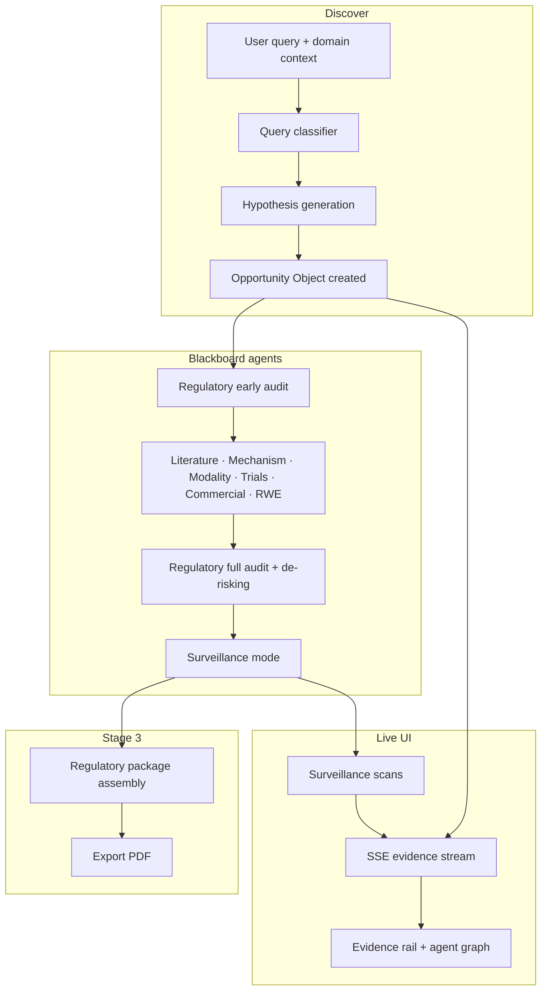

# Arclight Bio — Opportunity Space

**The discovery engine that finds what your experts don't know to look for.**

Living discovery platform for the life sciences. Built for [Nucleate NY BioHack 2026](https://nucleate.xyz/) — Track 02 (Autonomous Research) · Track 05 (Regulatory).

Every discovery session runs **live queries** against public biomedical APIs. No pre-filled demo data, no cached JSON pretending to be research.

---

## What's new (June 2026)

This section documents the major upgrades shipped after the initial build spec. If you are onboarding or demoing, start here.

### Agent Upgrade v2.0

The blackboard pipeline was expanded from six to **seven agents**, with richer evidence types and domain-aware behavior. Full specification: [`public/arclight_agent_upgrade_spec.md`](public/arclight_agent_upgrade_spec.md).

| Capability | Before | After |
|------------|--------|-------|
| Literature search | Single-domain PubMed query | Multi-domain parallel search + cross-citation detection |
| Target prioritization | Pathway associations only | Ranked target list with druggability composite scores |
| Modality recommendation | Not present | New **Modality** agent recommends modality per target |
| Regulatory challenges | Gap identification only | **De-risk recommendations** (study type, endpoints, n, timeline) |
| Domain awareness | Org context only | **Domain context flag** shapes hypothesis, search domains, and agent priorities |
| First-in-class novelty | Not present | Explicit absence search with verdict cards (`confirmed` / `likely` / `uncertain` / `prior_art`) |

**New blackboard order** (after regulatory early audit):

1. Literature → 2. Mechanism → 3. **Modality** → 4. Clinical trial → 5. Commercial → 6. RWE signal → 7. Regulatory (full audit)

**New evidence card flags** (migration `011_agent_upgrade.sql`):

| Column | Purpose |
|--------|---------|
| `is_cross_domain` | Literature agent cross-domain connection cards (highest-value signals) |
| `is_target_list` | Mechanism agent prioritized target ranking card |
| `is_modality_card` | Modality agent recommendation card |
| `is_novelty_check` | Clinical trial agent first-in-class novelty verdict card |
| `derisk_recommendation` | JSON on regulatory challenge cards — specific study design to close the gap |

**New opportunity fields:**

| Field | Purpose |
|-------|---------|
| `domain_context` | Discovery mode: `general`, `oncology first-in-class`, `autoimmune chronic`, `sex-specific biology`, `rare disease` |
| `indication_type` | Derived from domain context; adjusts actionability zone thresholds (`oncology`, `autoimmune_chronic`, `rare_disease`) |

**Literature agent — indication specificity filter**

Papers are only retained if they study the same disease/population as the hypothesis, or explicitly link a mechanism to that disease in the paper itself. This prevents generic mechanism papers from inflating unrelated sessions (e.g. JAK papers from lupus appearing in an RA session). Implemented in [`src/agents/literatureAgent.ts`](src/agents/literatureAgent.ts) via `INDICATION_SPECIFICITY_RULE` in the agent system prompt and patient population / unmet need in the user prompt.

**Mechanism agent — druggability ranking**

Produces a `PRIORITIZED TARGETS` card (`is_target_list: true`) with ranked targets scored on structural druggability, pathway confidence, clinical novelty, and safety precedent. Composite druggability score drives rank order. Parsed by [`src/lib/targetList.ts`](src/lib/targetList.ts); displayed in `PrioritizedTargetsPanel`.

**Modality agent**

Runs after mechanism so it can read ranked targets. Recommends primary and alternative modalities per target with manufacturing complexity, timeline-to-IND estimate, and infrastructure fit. Assessments stored in `raw_source_metadata.modality_assessments`. Types in [`src/lib/modalityTypes.ts`](src/lib/modalityTypes.ts).

**Clinical trial agent — novelty check**

For first-in-class domain contexts, runs an explicit absence search (ClinicalTrials.gov + patents where available) and posts a novelty verdict card per top target. Requires `LENS_API_KEY` for full patent coverage; partial assessment without it.

**Regulatory agent — de-risking**

Challenge cards can now include a `derisk_recommendation` object: study type, primary objective, patient population, sample size, endpoint, and estimated timeline. Rendered in `ChallengeCard` and summarized in the session summary panel.

### Opportunity page UI rebrand

The opportunity detail page (`/opportunity/[id]`) was redesigned into a **three-column layout** optimized for narrative reading and agent observability.

```
┌─────────────────┬──────────────────────────┬─────────────────┐
│  Left sidebar   │     Center column        │   Right rail    │
│  (280px, dark)  │     (narrative)          │   (300px)       │
├─────────────────┼──────────────────────────┼─────────────────┤
│ Global nav      │ OpportunityHeader        │ ScoreStrip      │
│ Evidence stream │ PrioritizedTargetsPanel  │ ModalityPanel   │
│ (compact rows)  │ HypothesisPanel          │ AgentNodeGraph  │
│ Surveillance    │ SessionSummaryPanel      │                 │
└─────────────────┴──────────────────────────┴─────────────────┘
```

Dashboard and Discover pages keep the standard **220px nav-only** sidebar. The expanded 280px sidebar with evidence and surveillance appears **only on opportunity detail pages**.

**Left rail — evidence & surveillance**

| Component | File | Behavior |
|-----------|------|----------|
| `OpportunitySidebarRail` | `src/components/opportunity/OpportunitySidebarRail.tsx` | Wraps evidence + surveillance for dark sidebar |
| `EvidenceStreamRail` | `src/components/opportunity/EvidenceStreamRail.tsx` | Compact desaturated rows: agent color dot + 2-line claim + time. Expand on click for full card. Filters when an agent is selected in the graph |
| `SurveillanceRail` | `src/components/opportunity/SurveillanceRail.tsx` | Collapsible panel at sidebar bottom; status chip + countdown when collapsed; full step list when expanded |

**Center column — reordered stack**

| Order | Component | Notes |
|-------|-----------|-------|
| 1 | `OpportunityHeader` | Query title, mode/domain/status badges, hypothesis subtitle |
| 2 | `PrioritizedTargetsPanel` | Top 3 ranked targets with druggability bars |
| 3 | `HypothesisPanel` | Named hypothesis + 3-column detail blocks; score sparkline removed |
| 4 | `SessionSummaryPanel` | 3–5 bullets derived client-side via [`src/lib/sessionSummary.ts`](src/lib/sessionSummary.ts) |

**Right rail — insight**

| Component | Notes |
|-----------|-------|
| `ScoreStrip` | Single row: `Confidence 0.73 \| Actionability Act Now` — decimals, no progress bars |
| `ModalityPanel` | Unchanged logic, tighter placement above graph |
| `AgentNodeGraph` | SVG + framer-motion node web; hypothesis center, 7 agent rings, evidence leaf dots; click to zoom/focus and filter evidence rail |

**Removed from opportunity page:** `ConfidenceGauge`, `ActionabilityZoneBar`, session stats panel (Cards/Challenges/Agents counts), and center-column `OpportunityFeed` grid. Those gauge components remain available for dashboard reuse.

**Shared UI state**

`selectedAgent: AgentName | null` in [`src/store/opportunityStore.ts`](src/store/opportunityStore.ts) connects the agent graph to the evidence rail. Click an agent node → graph zooms and rail filters; click root or same agent again → reset.

**Mobile**

Below `lg` breakpoint, evidence and surveillance move to `MobileEvidenceDrawer` — a floating **Evidence** button opens a slide-in drawer. Desktop sidebar rail is hidden on small screens (`lg:flex`).

**Design tokens**

- Act-now green softened: `#2A9D8F` (`brand-teal` in `tailwind.config.ts`; agent-mechanism green stays `#1D9E75`)
- Panel borders: `#EDE8E0` (`--color-border-tertiary`)
- `EvidenceCardCompact` variant exported from [`src/components/opportunity/EvidenceCard.tsx`](src/components/opportunity/EvidenceCard.tsx)

### Spacebase1 Observatory reconnect

Observatory URL resolution was fixed so hash fragments in Spacebase URLs are not lost.

**Problem:** Setting `SPACEBASE_OBSERVATORY_URL` in `.env.local` failed because dotenv treats `#` as a comment delimiter, truncating the URL at the space id hash.

**Fix:** [`src/app/api/spacebase/observatory/route.ts`](src/app/api/spacebase/observatory/route.ts) reads the URL from claim output files first:

1. `.spacebase/arclightbio/observatory.json` (written by `claim.py`)
2. `.spacebase/arclightbio/.intent-space/state/station-enrollment.json`
3. `SPACEBASE_OBSERVATORY_URL` env var (fallback only)

**Do not** set `SPACEBASE_OBSERVATORY_URL` in `.env.local`. After running `claim.py`, the sidebar **Open Observatory** link resolves automatically.

Prepared space (current): `space-46111387-13ad-4e0f-b6ba-96fe54255d26` · agent label `archlightBio`.

---

## The idea

Traditional drug discovery is bounded by three structural limits:

| Problem | Why talent alone can't fix it |
|--------|-------------------------------|
| **Expert-gated search** | Experts define scope using the same mental models they were trained in |
| **Organizational silos** | A cardiac signal never automatically triggers a conversation with the ATTR team |
| **Point-in-time reports** | Static decks go stale; nothing watches the literature and updates conclusions |

**Opportunity Space** addresses this with a shared living artifact — the **Opportunity Object** — that autonomous agents continuously enrich from real public data.

The core insight: the most valuable opportunities often live *between* the categories your organization has already defined.

### Three operating stages

1. **Discovery** — A human query (or future autonomous anchor) spawns a hypothesis and seven blackboard agents contribute evidence in parallel.
2. **Surveillance** — After blackboard completes, the opportunity enters a watching state: PubMed, trials, and patents are polled for new signals; confidence scores update when relevant evidence arrives.
3. **Regulatory assembly** — For high-confidence "Act now" opportunities, the same Opportunity Object is version-locked and exported as an FDA/EMA-aligned regulatory intelligence package (including PDF).

---

## How a discovery session works



1. User enters a query on `/discover`, selects **Speed** or **Depth** mode, picks an **org context**, and optionally a **domain context** (e.g. oncology first-in-class).
2. Claude classifies query maturity (`preclinical` / `clinical` / `established`) and sets a **prior score** anchor.
3. PubMed results seed a hypothesis tailored to the org context and domain adjustments.
4. Seven agents run sequentially on the blackboard (see order above), each posting evidence cards.
5. The opportunity page streams updates via SSE; evidence appears in the left sidebar rail and agent graph.
6. Scores recompute after each agent; the **actionability zone** (Too early / Act now / Crowded) reflects org-specific thresholds and indication type.
7. Surveillance tags are generated; ongoing scans add new PubMed papers when relevant.
8. Act now opportunities can assemble a **Regulatory Package** with provenance trail and compliance gaps mapped to FDA January 2025 AI guidance.

---

## Core concepts

### Opportunity Object

The central data structure. One object per discovery session, persisted in Supabase (or in-memory for local dev without DB).

| Field | Purpose |
|-------|---------|
| `hypothesis` | Statement, patient population, unmet need, org positioning |
| `evidence_cards` | Agent-contributed evidence with quality scores and source URLs |
| `challenges` | Regulatory challenge cards that penalize confidence |
| `confidence_score` | 0–1, prior-anchored blend of evidence quality |
| `actionability_zone` | `too_early` · `act_now` · `crowded` |
| `query_tier` | Maturity classification driving the score prior |
| `evidence_tier` | Display tier badge (preclinical / clinical / established) |
| `domain_context` | Discovery mode shaping agent behavior (v2.0) |
| `indication_type` | Oncology / autoimmune / rare disease — affects zone thresholds |
| `surveillance_tags` | Concept/entity tags for ongoing field monitoring |
| `change_log` | Audit trail of score changes and surveillance events |
| `mode` | `speed` or `depth` — affects literature depth and evidence tier handling |

### Domain context

Selected on `/discover` before starting a session. Configured in [`src/lib/domainContext.ts`](src/lib/domainContext.ts).

| Value | Label | Effect |
|-------|-------|--------|
| `general` | General discovery | Standard agent configuration |
| `oncology first-in-class` | Oncology — first-in-class | Cross-domain search, target ranking, novelty check, modality |
| `autoimmune chronic` | Autoimmune / chronic disease | Higher safety bar, sex-specific biology, de-risking |
| `sex-specific biology` | Women's health | Immunology × reproductive health cross-domain search |
| `rare disease` | Rare disease | Lower evidence bar, orphan pathway assessment |

Domain context is persisted on the opportunity object and passed into literature expansion, hypothesis generation, and regulatory audit prompts.

### Blackboard agents

| Agent | Data sources | Role |
|-------|-------------|------|
| **Literature** | PubMed, Europe PMC | Multi-domain parallel search, cross-citation cards, indication filter |
| **Mechanism** | Open Targets | Target–disease associations, **prioritized target list** with druggability scores |
| **Modality** | Claude | **Modality recommendation** per ranked target (new in v2.0) |
| **Clinical trial** | ClinicalTrials.gov | Trial relevance filter, **first-in-class novelty check** |
| **Commercial** | OpenFDA, Lens patents | Market saturation, competitive landscape |
| **RWE signal** | OpenFDA FAERS | Real-world adverse event patterns |
| **Regulatory** | Internal audit | Early + full compliance challenges, **de-risk study recommendations** |

Agents write to the same blackboard without a central orchestrator deciding conclusions — the Opportunity Object accumulates their outputs.

### Scoring

**Confidence** uses a tier prior anchored to query maturity:

| Tier | Prior | Typical queries |
|------|-------|-----------------|
| Preclinical | 0.15 | exosome, microRNA, telomere aging |
| Clinical | 0.45 | novel subgroups, unapproved combinations |
| Established | 0.70 | trastuzumab HER2, approved checkpoint inhibitors |

Evidence cards are weighted by agent type (clinical trials 1.5×, mechanism 0.25×), blended with the prior (`PRIOR_WEIGHT = 4`), then adjusted for regulatory challenges and trial saturation.

**Actionability zone** maps confidence against org-specific lower/upper thresholds from the selected organization context, modified by `indication_type`.

### Organization context

Org contexts (Pfizer, J&J, etc.) define therapeutic areas, risk tolerance, and commercial weighting. The same evidence scores differently depending on which org is evaluating the opportunity.

---

## Tech stack

| Layer | Choice |
|-------|--------|
| Framework | Next.js 14 (App Router) |
| Language | TypeScript |
| UI | Tailwind CSS · shadcn/ui · Lucide icons · framer-motion |
| State | Zustand · TanStack Query |
| Database | Supabase (PostgreSQL) — optional in-memory fallback |
| LLM | Anthropic Claude (hypothesis, classification, regulatory audit, surveillance tags, domain expansion) |
| PDF export | jsPDF 2.5.1 |
| Live agent observability | Spacebase1 intent space (optional) |

---

## Project structure

```
src/
  app/                    # Next.js routes and API handlers
    discover/             # New discovery UI (domain context selector)
    opportunity/[id]/     # Rebranded 3-column session view + regulatory assembly
    admin/                # Dev admin (Shift+P shortcut)
    api/                  # REST + SSE endpoints
      spacebase/          # Observatory URL resolver
  agents/                 # Blackboard agents (incl. modalityAgent.ts)
  api/                    # Typed wrappers for external biomedical APIs
  components/
    layout/               # AppShell, Sidebar (opportunity-aware width)
    opportunity/          # Rebrand components (see below)
    regulatory/           # Stage 3 assembly UI
  hooks/
    useSurveillanceSessionControls.ts  # Shared pause/resume for page + sidebar
  lib/
    agentGraph.ts         # Agent node graph layout builder
    sessionSummary.ts     # Client-side session summary bullets
    domainContext.ts      # Domain context definitions + adjustments
    modalityTypes.ts      # Modality assessment types
    targetList.ts         # Prioritized target parsing
    blackboard.ts         # Agent orchestration (7 agents)
  store/                  # Zustand stores (incl. selectedAgent)
  types/                  # OpportunityObject, RegulatoryPackage, etc.
scripts/
  spacebase/              # Spacebase1 claim + intent emit bridge
    claim.py              # Claims prepared space, writes observatory.json
    common.py             # Shared space id + workspace config
    emit.py               # Emit intent events from CLI
supabase/migrations/      # PostgreSQL schema (run 001 → 011 in order)
public/
  arclight_agent_upgrade_spec.md  # Agent v2.0 specification
```

### Opportunity UI components (rebrand)

| File | Purpose |
|------|---------|
| `OpportunityHeader.tsx` | Query title, badges, hypothesis subtitle |
| `SessionSummaryPanel.tsx` | Derived bullet summary |
| `ScoreStrip.tsx` | Compact confidence + actionability display |
| `EvidenceStreamRail.tsx` | Sidebar evidence stream (compact rows) |
| `SurveillanceRail.tsx` | Sidebar surveillance (collapsible) |
| `OpportunitySidebarRail.tsx` | Combines evidence + surveillance rails |
| `AgentNodeGraph.tsx` | Interactive SVG agent network |
| `MobileEvidenceDrawer.tsx` | Mobile slide-in drawer |
| `PrioritizedTargetsPanel.tsx` | Ranked targets from mechanism agent |
| `ModalityPanel.tsx` | Modality recommendations |
| `OpportunityFeed.tsx` | Legacy center feed (retained; no longer used on detail page) |

---

## Setup

### Prerequisites

- Node.js 18+
- Python 3 (only if using Spacebase1 Observatory bridge)
- API keys (see below)

### Install and run

```bash
cp .env.local.example .env.local
# Edit .env.local with your keys

npm install
npm run dev
```

Open [http://localhost:3000](http://localhost:3000).

If styles look broken after a dev server restart, hard-refresh the browser (`Cmd+Shift+R`) or clear `.next` and restart:

```bash
lsof -ti:3000 | xargs kill -9
rm -rf .next && npm run dev
```

### Supabase (recommended for persistence)

1. Create a Supabase project.
2. Add credentials to `.env.local`:
   ```env
   NEXT_PUBLIC_SUPABASE_URL=https://your-project.supabase.co
   NEXT_PUBLIC_SUPABASE_ANON_KEY=your_anon_key
   SUPABASE_SERVICE_ROLE_KEY=your_service_role_key
   ```
3. Run migrations in order from `supabase/migrations/` in the Supabase SQL Editor (**001 → 011**).

Without Supabase, the app falls back to an in-memory store — fine for demos, but data is lost on restart.

---

## Environment variables

| Variable | Required | Purpose |
|----------|----------|---------|
| `ANTHROPIC_API_KEY` | Yes | Hypothesis, agents, classifier, regulatory audit, domain expansion |
| `NCBI_API_KEY` | Recommended | PubMed (higher rate limits) |
| `SEMANTIC_SCHOLAR_API_KEY` | Optional | Depth mode literature enrichment |
| `OPENFDA_API_KEY` | Optional | FAERS / drug label queries |
| `LENS_API_KEY` | Optional | Patent search (commercial agent + novelty check) |
| `NEXT_PUBLIC_SUPABASE_*` | Optional | Persistence |
| `SUPABASE_SERVICE_ROLE_KEY` | Optional | Server-side DB writes |
| `SPACEBASE_ENABLED` | Optional | Broadcast agent lifecycle to Observatory |
| `SPACEBASE_WORKSPACE` | Optional | Path to Spacebase workspace (default `.spacebase/arclightbio`) |
| `NEXT_PUBLIC_SURVEILLANCE_POLL_MS` | Optional | Dashboard poll interval (default 30s demo / 86400000 daily) |

**Do not set** `SPACEBASE_OBSERVATORY_URL` in `.env.local` — URL hash fragments are stripped by dotenv. Use `claim.py` and read from `observatory.json` instead.

See [`.env.local.example`](.env.local.example) for the full list.

---

## Routes

### UI

| Path | Description |
|------|-------------|
| `/` | Dashboard — opportunity queue, metrics, featured cards |
| `/discover` | Start a new discovery session (Speed / Depth, org + **domain context**) |
| `/opportunity/[id]` | **Rebranded session view** — 3-column layout: sidebar evidence rail, center narrative, right insight rail with agent graph |
| `/opportunity/[id]/regulatory` | Stage 3 regulatory assembly + PDF export |
| `/admin` | Dev admin tools (open with **Shift+P** anywhere) |

### API (selected)

| Endpoint | Method | Purpose |
|----------|--------|---------|
| `/api/discover` | POST | Create opportunity + start blackboard (accepts `domainContext`) |
| `/api/discover/classify` | POST | Preview query tier classification |
| `/api/opportunities` | GET | List all opportunities |
| `/api/opportunity/[id]` | GET | Single opportunity with cards |
| `/api/stream/[id]` | GET | SSE live updates during discovery |
| `/api/surveillance/[id]/stream` | GET | SSE surveillance scan progress |
| `/api/opportunity/[id]/pause` | POST | Pause surveillance |
| `/api/opportunity/[id]/resume` | POST | Resume surveillance |
| `/api/regulatory/[id]` | POST | Assemble regulatory package |
| `/api/spacebase/observatory` | GET | Resolve Observatory URL from claim files |
| `/api/admin/backfill` | POST | Recompute scores + tier backfill |
| `/api/admin/stop-surveillance` | POST | Pause all active surveillance sessions |
| `/api/health?service=pubmed&q=...` | GET | API connectivity smoke tests |

---

## Demo & test sessions

Recommended queries for validating v2.0 features:

| Test | Query / context | What to verify |
|------|-----------------|----------------|
| **A** | Preclinical anchor (e.g. exosome aging) | Low prior, too-early zone |
| **B** | Established therapy (e.g. trastuzumab HER2) | High prior, crowded zone |
| **C** | Novel subgroup in approved class | Clinical tier, act-now potential |
| **D** | Competitive crowded space | Commercial saturation signals |
| **E** | TTR amyloidosis · **rare disease** context | Orphan pathway, lower evidence bar |
| **F** | JAK inhibitor rheumatoid arthritis · **autoimmune chronic** | Indication filter, cross-domain cards, target ranking, modality, novelty, Spacebase trace |

On Test F, verify the rebrand: evidence in left sidebar, agent graph click filters rail, session summary bullets populate, surveillance collapses at sidebar bottom.

---

## Admin tools (`/admin`, Shift+P)

| Action | What it does |
|--------|--------------|
| **Run backfill** | Recompute evidence quality, apply prior-anchored scoring, update zones. Uses stored `query_tier`; runs Claude classifier only when `query_tier` is null. |
| **Stop all surveillance** | Pauses every opportunity in `surveillance` or `complete` status |
| **Regenerate all tags** | Rebuild Claude-powered surveillance tags from hypotheses |

To force re-classification of all query tiers before backfill:

```sql
UPDATE opportunity_objects SET query_tier = NULL;
```

---

## Regulatory package & PDF export

Available when an opportunity is in the **Act now** zone.

1. Navigate to `/opportunity/[id]/regulatory`
2. Click **Assemble Package** — version-locks the object, builds provenance trail, runs compliance checker
3. Click **Export PDF** — downloads a multi-page A4 document:

   - Cover page (hypothesis, version lock hash, FDA guidance reference)
   - AI role declaration + agent data-source table
   - Evidence credibility report
   - Compliance gap analysis (blocking / advisory)
   - Provenance trail with source hashes
   - Certification page

Implementation: [`src/lib/regulatoryPdf.ts`](src/lib/regulatoryPdf.ts) (client-side jsPDF).

---

## Spacebase1 Observatory (optional)

Agent lifecycle events (session start, per-agent run, surveillance scans) can be broadcast to a [Spacebase1](https://spacebase1.differ.ac) intent space for live viewing in the Observatory UI.

```bash
# One-time space claim (writes observatory.json)
python3 scripts/spacebase/claim.py

# Enable in .env.local
SPACEBASE_ENABLED=true
SPACEBASE_WORKSPACE=.spacebase/arclightbio
```

Use **Open Observatory** in the sidebar, or `GET /api/spacebase/observatory` for the URL.

Emit a test event manually:

```bash
SPACEBASE_ENABLED=true SPACEBASE_WORKSPACE=.spacebase/arclightbio \
  python3 scripts/spacebase/emit.py '{"type":"session_started","opportunityId":"test","searchQuery":"hello"}'
```

---

## API health checks

Verify external integrations without starting a full discovery:

```
GET /api/health?service=pubmed&q=cardiac+amyloidosis
GET /api/health?service=clinicaltrials&q=ATTR
GET /api/health?service=opentargets&q=TTR
GET /api/health?service=openfda&q=metformin
GET /api/health?service=anthropic
```

---

## Scripts

```bash
npm run dev      # Development server
npm run build    # Production build
npm run start    # Production server
npm run lint     # ESLint
```

---

## Database migrations

Run in order in Supabase SQL Editor:

| Migration | Purpose |
|-----------|---------|
| `001_opportunity_objects.sql` | Core opportunity table |
| `002_evidence_cards.sql` | Evidence cards |
| `003_org_contexts.sql` | Organization contexts |
| `004_regulatory_packages.sql` | Regulatory package storage |
| `005_backfill_actionability_zones.sql` | Zone backfill |
| `006_clear_surveillance_tags.sql` | Tag cleanup |
| `007_update_pfizer_org_context.sql` | Pfizer org update |
| `008_evidence_tier.sql` | Evidence tier column |
| `009_query_tier.sql` | Query tier column |
| `010_query_tier_null_default.sql` | Query tier default fix |
| `011_agent_upgrade.sql` | **v2.0:** domain_context, indication_type, card flags, derisk_recommendation |

---

## Further reading

- [`public/arclight_agent_upgrade_spec.md`](public/arclight_agent_upgrade_spec.md) — Agent v2.0 specification (multi-domain literature, modality, novelty, de-risking)
- [`opportunity_space_build_spec.md`](opportunity_space_build_spec.md) — Original product specification, API contracts, and phased build plan
- [`supabase/migrations/`](supabase/migrations/) — Database schema evolution

---

## License

Private — Arclight Bio · Nucleate NY BioHack 2026
