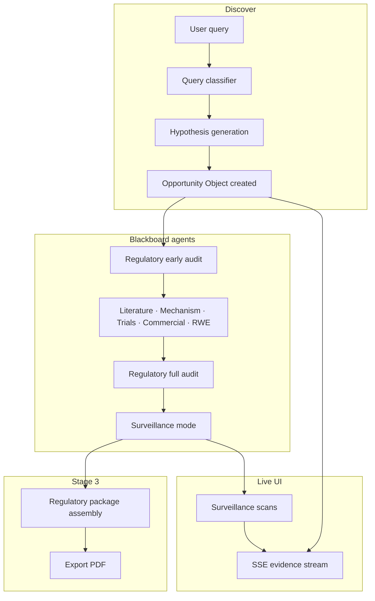

# Arclight Bio — Opportunity Space

**The discovery engine that finds what your experts don't know to look for.**

Living discovery platform for the life sciences. Built for [Nucleate NY BioHack 2026](https://nucleate.xyz/) — Track 02 (Autonomous Research) · Track 05 (Regulatory).

Every discovery session runs **live queries** against public biomedical APIs. No pre-filled demo data, no cached JSON pretending to be research.

---

## The idea

Traditional drug discovery is bounded by three structural limits:

| Problem | Why talent alone can't fix it |
|--------|-------------------------------|
| **Expert-gated search** | Experts define scope using the same mental models they were trained in |
| **Organizational silos** | A cardiac signal never automatically triggers a conversation with the ATTR team |
| **Point-in-time reports** | Static decks go stale; nothing watches the literature and updates conclusions |

**Opportunity Space** addresses this with a shared living artifact — the **Opportunity Object** — that autonomous agents continuously enrich from real public data.

The core insight: the most valuable opportunities often live *between* the categories your organization has already defined.

### Three operating stages

1. **Discovery** — A human query (or future autonomous anchor) spawns a hypothesis and six blackboard agents contribute evidence in parallel.
2. **Surveillance** — After blackboard completes, the opportunity enters a watching state: PubMed, trials, and patents are polled for new signals; confidence scores update when relevant evidence arrives.
3. **Regulatory assembly** — For high-confidence "Act now" opportunities, the same Opportunity Object is version-locked and exported as an FDA/EMA-aligned regulatory intelligence package (including PDF).

---

## How a discovery session works



1. User enters a query on `/discover` (Speed or Depth mode).
2. Claude classifies query maturity (`preclinical` / `clinical` / `established`) and sets a **prior score** anchor.
3. PubMed results seed a hypothesis tailored to the selected **org context** (e.g. Pfizer cardiology/oncology portfolio).
4. Six agents run sequentially on the blackboard, each posting **evidence cards** to a shared object.
5. The opportunity detail page streams updates via SSE while agents run.
6. Scores recompute after each agent; the **actionability zone** (Too early / Act now / Crowded) reflects org-specific thresholds.
7. Surveillance tags are generated; ongoing scans add new PubMed papers when relevant.
8. Act now opportunities can assemble a **Regulatory Package** with provenance trail and compliance gaps mapped to FDA January 2025 AI guidance.

---

## Core concepts

### Opportunity Object

The central data structure. One object per discovery session, persisted in Supabase (or in-memory for local dev without DB).

| Field | Purpose |
|-------|---------|
| `hypothesis` | Statement, patient population, unmet need, org positioning |
| `evidence_cards` | Agent-contributed evidence with quality scores and source URLs |
| `challenges` | Regulatory challenge cards that penalize confidence |
| `confidence_score` | 0–1, prior-anchored blend of evidence quality |
| `actionability_zone` | `too_early` · `act_now` · `crowded` |
| `query_tier` | Maturity classification driving the score prior |
| `surveillance_tags` | Concept/entity tags for ongoing field monitoring |
| `change_log` | Audit trail of score changes and surveillance events |

### Blackboard agents

| Agent | Data sources | Role |
|-------|-------------|------|
| **Literature** | PubMed, Europe PMC | Papers, study quality, recency |
| **Mechanism** | Open Targets | Target–disease associations, pathway evidence |
| **Clinical trial** | ClinicalTrials.gov | Trial relevance filter (not raw count inflation) |
| **Commercial** | OpenFDA, Lens patents | Market saturation, competitive landscape |
| **RWE signal** | OpenFDA FAERS | Real-world adverse event patterns |
| **Regulatory** | Internal audit | Early + full compliance challenges on evidence |

Agents write to the same blackboard without a central orchestrator deciding conclusions — the Opportunity Object accumulates their outputs.

### Scoring

**Confidence** uses a tier prior anchored to query maturity:

| Tier | Prior | Typical queries |
|------|-------|-----------------|
| Preclinical | 0.15 | exosome, microRNA, telomere aging |
| Clinical | 0.45 | novel subgroups, unapproved combinations |
| Established | 0.70 | trastuzumab HER2, approved checkpoint inhibitors |

Evidence cards are weighted by agent type (clinical trials 1.5×, mechanism 0.25×), blended with the prior (`PRIOR_WEIGHT = 4`), then adjusted for regulatory challenges and trial saturation.

**Actionability zone** maps confidence against org-specific lower/upper thresholds from the selected organization context.

### Organization context

Org contexts (Pfizer, J&J, etc.) define therapeutic areas, risk tolerance, and commercial weighting. The same evidence scores differently depending on which org is evaluating the opportunity.

---

## Tech stack

| Layer | Choice |
|-------|--------|
| Framework | Next.js 14 (App Router) |
| Language | TypeScript |
| UI | Tailwind CSS · shadcn/ui · Lucide icons |
| State | Zustand · TanStack Query |
| Database | Supabase (PostgreSQL) — optional in-memory fallback |
| LLM | Anthropic Claude (hypothesis, classification, regulatory audit, surveillance tags) |
| PDF export | jsPDF 2.5.1 |
| Live agent observability | Spacebase1 intent space (optional) |

---

## Project structure

```
src/
  app/                    # Next.js routes and API handlers
    discover/             # New discovery UI
    opportunity/[id]/     # Live session + regulatory assembly
    admin/                # Dev admin (Shift+P shortcut)
    api/                  # REST + SSE endpoints
  agents/                 # Blackboard + Stage 1 autonomous agents
  api/                    # Typed wrappers for external biomedical APIs
  components/             # UI (dashboard, opportunity, regulatory)
  lib/                    # Blackboard, scoring, surveillance, db, PDF
  store/                  # Zustand stores
  types/                  # OpportunityObject, RegulatoryPackage, etc.
scripts/
  spacebase/              # Spacebase1 claim + intent emit bridge
supabase/migrations/      # PostgreSQL schema (run in order)
```

---

## Setup

### Prerequisites

- Node.js 18+
- Python 3 (only if using Spacebase1 Observatory bridge)
- API keys (see below)

### Install and run

```bash
cp .env.local.example .env.local
# Edit .env.local with your keys

npm install
npm run dev
```

Open [http://localhost:3000](http://localhost:3000).

If styles look broken after a dev server restart, hard-refresh the browser (`Cmd+Shift+R`) or clear `.next` and restart:

```bash
lsof -ti:3000 | xargs kill -9
rm -rf .next && npm run dev
```

### Supabase (recommended for persistence)

1. Create a Supabase project.
2. Add credentials to `.env.local`:
   ```env
   NEXT_PUBLIC_SUPABASE_URL=https://your-project.supabase.co
   NEXT_PUBLIC_SUPABASE_ANON_KEY=your_anon_key
   SUPABASE_SERVICE_ROLE_KEY=your_service_role_key
   ```
3. Run migrations in order from `supabase/migrations/` in the Supabase SQL Editor (001 → 010).

Without Supabase, the app falls back to an in-memory store — fine for demos, but data is lost on restart.

---

## Environment variables

| Variable | Required | Purpose |
|----------|----------|---------|
| `ANTHROPIC_API_KEY` | Yes | Hypothesis, agents, classifier, regulatory audit |
| `NCBI_API_KEY` | Recommended | PubMed (higher rate limits) |
| `SEMANTIC_SCHOLAR_API_KEY` | Optional | Depth mode literature enrichment |
| `OPENFDA_API_KEY` | Optional | FAERS / drug label queries |
| `LENS_API_KEY` | Optional | Patent search (commercial agent) |
| `NEXT_PUBLIC_SUPABASE_*` | Optional | Persistence |
| `SUPABASE_SERVICE_ROLE_KEY` | Optional | Server-side DB writes |
| `SPACEBASE_ENABLED` | Optional | Broadcast agent lifecycle to Observatory |
| `NEXT_PUBLIC_SURVEILLANCE_POLL_MS` | Optional | Dashboard poll interval (default 30s demo / 86400000 daily) |

See [`.env.local.example`](.env.local.example) for the full list.

---

## Routes

### UI

| Path | Description |
|------|-------------|
| `/` | Dashboard — opportunity queue, metrics, featured cards |
| `/discover` | Start a new discovery session (Speed / Depth) |
| `/opportunity/[id]` | Live evidence stream, hypothesis, surveillance panel |
| `/opportunity/[id]/regulatory` | Stage 3 regulatory assembly + PDF export |
| `/admin` | Dev admin tools (open with **Shift+P** anywhere) |

### API (selected)

| Endpoint | Method | Purpose |
|----------|--------|---------|
| `/api/discover` | POST | Create opportunity + start blackboard |
| `/api/discover/classify` | POST | Preview query tier classification |
| `/api/opportunities` | GET | List all opportunities |
| `/api/opportunity/[id]` | GET | Single opportunity with cards |
| `/api/stream/[id]` | GET | SSE live updates during discovery |
| `/api/surveillance/[id]/stream` | GET | SSE surveillance scan progress |
| `/api/opportunity/[id]/pause` | POST | Pause surveillance |
| `/api/opportunity/[id]/resume` | POST | Resume surveillance |
| `/api/regulatory/[id]` | POST | Assemble regulatory package |
| `/api/admin/backfill` | POST | Recompute scores + tier backfill |
| `/api/admin/stop-surveillance` | POST | Pause all active surveillance sessions |
| `/api/health?service=pubmed&q=...` | GET | API connectivity smoke tests |

---

## Admin tools (`/admin`, Shift+P)

| Action | What it does |
|--------|--------------|
| **Run backfill** | Recompute evidence quality, apply prior-anchored scoring, update zones. Uses stored `query_tier`; runs Claude classifier only when `query_tier` is null. |
| **Stop all surveillance** | Pauses every opportunity in `surveillance` or `complete` status |
| **Regenerate all tags** | Rebuild Claude-powered surveillance tags from hypotheses |

To force re-classification of all query tiers before backfill:

```sql
UPDATE opportunity_objects SET query_tier = NULL;
```

---

## Regulatory package & PDF export

Available when an opportunity is in the **Act now** zone.

1. Navigate to `/opportunity/[id]/regulatory`
2. Click **Assemble Package** — version-locks the object, builds provenance trail, runs compliance checker
3. Click **Export PDF** — downloads a multi-page A4 document:

   - Cover page (hypothesis, version lock hash, FDA guidance reference)
   - AI role declaration + agent data-source table
   - Evidence credibility report
   - Compliance gap analysis (blocking / advisory)
   - Provenance trail with source hashes
   - Certification page

Implementation: [`src/lib/regulatoryPdf.ts`](src/lib/regulatoryPdf.ts) (client-side jsPDF).

---

## Spacebase1 Observatory (optional)

Agent lifecycle events (session start, per-agent run, surveillance scans) can be broadcast to a [Spacebase1](https://spacebase1.differ.ac) intent space for live viewing in the Observatory UI.

```bash
# One-time space claim
python3 scripts/spacebase/claim.py

# Enable in .env.local
SPACEBASE_ENABLED=true
SPACEBASE_WORKSPACE=.spacebase/arclightbio
```

Use **Open Observatory** in the sidebar, or `GET /api/spacebase/observatory` for the URL.

---

## API health checks

Verify external integrations without starting a full discovery:

```
GET /api/health?service=pubmed&q=cardiac+amyloidosis
GET /api/health?service=clinicaltrials&q=ATTR
GET /api/health?service=opentargets&q=TTR
GET /api/health?service=openfda&q=metformin
GET /api/health?service=anthropic
```

---

## Scripts

```bash
npm run dev      # Development server
npm run build    # Production build
npm run start    # Production server
npm run lint     # ESLint
```

---

## Further reading

- [`opportunity_space_build_spec.md`](opportunity_space_build_spec.md) — Full product specification, API contracts, and phased build plan
- [`supabase/migrations/`](supabase/migrations/) — Database schema evolution

---

## License

Private — Arclight Bio · Nucleate NY BioHack 2026
